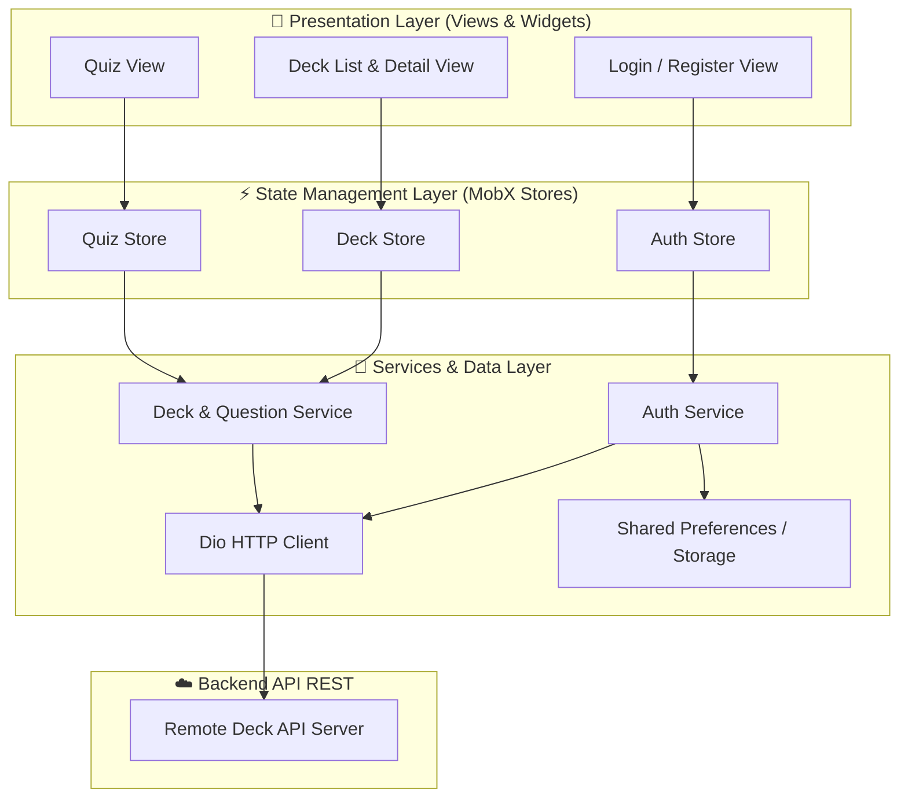

# My Deck App

[](https://flutter.dev/)
[](https://dart.dev/)
[](https://mobx.pub/)
[](https://pub.dev/packages/dio)
[](https://pub.dev/packages/get_it)

> 🇧🇷 [**Português**](README.md) | 🇺🇸 **English Version**

A practical and intuitive mobile application for smart study, flashcard management, and interactive quizzes.

## 📌 Quick Navigation

- [📝 About the Project](#-about-the-project)
- [🖼️ Preview](#️-preview)
- [⚡ API Endpoints](#-api-endpoints)
- [✨ Key Features](#-key-features)
- [🛠️ Technologies & Tools](#️-technologies--tools)
- [🏛️ Solution Architecture](#️-solution-architecture)
- [📁 Repository Structure](#-repository-structure)
- [💡 Technical Decisions](#-technical-decisions)
- [🚀 Getting Started](#-getting-started)

## 📝 About the Project

**My Deck** is a mobile application developed in Flutter designed to boost retention and active recall learning through the flashcard repetition method.

Focused on delivering an agile and smooth user experience, the solution allows students and professionals to organize their studies into categorized decks, register custom question-and-answer cards, and test their knowledge in a dedicated quiz mode featuring live scoring and instant feedback.

## 🖼️ Preview

<div align="center">
  
</div>

## ⚡ API Endpoints

The mobile app integrates with a RESTful API for authentication, deck synchronization, and flashcard management:

| Method | Endpoint | Description | Auth Required |
| :--- | :--- | :--- | :--- |
| `POST` | `/register` | New user account registration | No |
| `POST` | `/login` | User authentication and JWT token generation | No |
| `GET` | `/decks` | Fetch all decks of the authenticated user | Bearer Token |
| `POST` | `/decks` | Create a new study deck | Bearer Token |
| `DELETE` | `/decks/{id}` | Remove a specific deck | Bearer Token |
| `POST` | `/decks/{id}/questions` | Add a new question/flashcard to a deck | Bearer Token |

## ✨ Key Features

- 🔐 **Secure Authentication & Session**: User sign-up and login with secure local persistence of authorization tokens.
- 🗂️ **Deck Management**: Intuitive creation, listing, and deletion of categorized study decks.
- 🃏 **Flashcard Creation**: Dynamic registration of questions and answers linked to specific decks.
- 🧠 **Interactive Quiz Mode**: Study sessions with card transitions, answer validation, and final score calculations.
- ⚡ **Reactive UI Updates**: Fully synchronized user interface using MobX Stores, Observables, and Actions.

## 🛠️ Technologies & Tools

| Layer / Purpose | Technology | Description |
| :--- | :--- | :--- |
| **Primary Language** | **Dart 3.x** | Robust static typing, sound null safety, and high performance |
| **Mobile Framework** | **Flutter 3.x** | Multi-platform native framework with declarative rendering |
| **State Management** | **MobX & flutter_mobx** | Transparent reactive state management using Observables and Actions |
| **Dependency Injection** | **GetIt** | Decoupled Service Locator for HTTP client and service instances |
| **HTTP Client & Network** | **Dio** | REST requests, header interceptors, and robust error handling |
| **Local Persistence** | **Shared Preferences** | Lightweight key-value store for session token persistence |
| **Code Generation** | **build_runner & mobx_codegen** | Reactive boilerplate automation during build time |
| **Automated Testing** | **flutter_test & Mocktail** | Unit tests and mocking for business logic and stores |

## 🏛️ Solution Architecture

The project follows a **Feature-Based Architecture**, ensuring modularity, loose coupling, and clear separation between presentation, state control, and network layers:



## 📁 Repository Structure

```text
9-app-my-deck/
├── assets/                       # Images, animations, and static resources
├── lib/
│   ├── features/                 # Modular feature-based structure
│   │   ├── authentication/       # Login and sign-up flows, stores, and services
│   │   │   ├── dtos/             # Auth Data Transfer Objects
│   │   │   ├── services/         # Authentication network calls
│   │   │   └── views/            # Login and register screens
│   │   ├── decks/                # Deck and flashcard management
│   │   │   ├── dtos/             # Question creation DTOs
│   │   │   ├── services/         # Deck and question services
│   │   │   └── views/            # Deck list, creation, and detail screens
│   │   ├── quiz/                 # Quiz runner module
│   │   │   └── views/            # Interactive quiz interface
│   │   └── splash_screen/        # Session verification screen
│   ├── shared/                   # Global reusable components and utilities
│   │   ├── errors/               # Standardized error handling models
│   │   ├── models/               # Domain entities (Deck, Question, etc.)
│   │   ├── utils/                # Constants, routes, and network configs
│   │   └── views/                # Reusable shared widgets
│   ├── colors.dart               # Design system color definitions
│   └── main.dart                 # Application entry point & Service Locator init
├── test/                         # Unit and integration test suites by feature
├── pubspec.yaml                  # Project dependencies and metadata
└── analysis_options.yaml         # Linter rules and static analysis configuration
```

## 💡 Technical Decisions

- **Feature-First Architecture**: Modular organization where each feature contains its own views, stores, DTOs, and services for maximum maintainability.
- **State Management with MobX**: Adoption of transparent reactive programming via Observables, Computeds, and Actions to prevent unnecessary widget rebuilds.
- **Service Locator with GetIt**: Clean dependency injection for networking and shared singletons, enabling modular and easily mockable architecture.
- **Centralized Error Handling**: Transformation of raw Dio exceptions into domain-friendly `CustomError` instances for clean user feedback.
- **Testing with Mocktail**: Unit testing with decoupled mocks without code generation overhead for fast execution.

## 🚀 Getting Started

### Prerequisites

- [Flutter SDK](https://docs.flutter.dev/get-started/install) (^3.10.7 recommended)
- [Dart SDK](https://dart.dev/get-dart)
- Android / iOS emulator configured or a physical device connected

### Installation & Run

1. **Clone the repository:**
   ```bash
   git clone https://github.com/ludson96/9-app-my-deck.git
   cd 9-app-my-deck
   ```

2. **Install dependencies:**
   ```bash
   flutter pub get
   ```

3. **Generate MobX code (if needed):**
   ```bash
   flutter pub run build_runner build --delete-conflicting-outputs
   ```

4. **Run the application:**
   ```bash
   flutter run
   ```

5. **Run automated tests:**
   ```bash
   flutter test
   ```

<div align="center">
  Developed by <strong>Ludson Pereira dos Santos</strong> 🚀<br />
  <a href="https://www.linkedin.com/in/ludson96/">LinkedIn</a> • <a href="https://github.com/ludson96">GitHub</a> • <a href="mailto:ludson_ps27@hotmail.com">E-mail</a>
</div>
