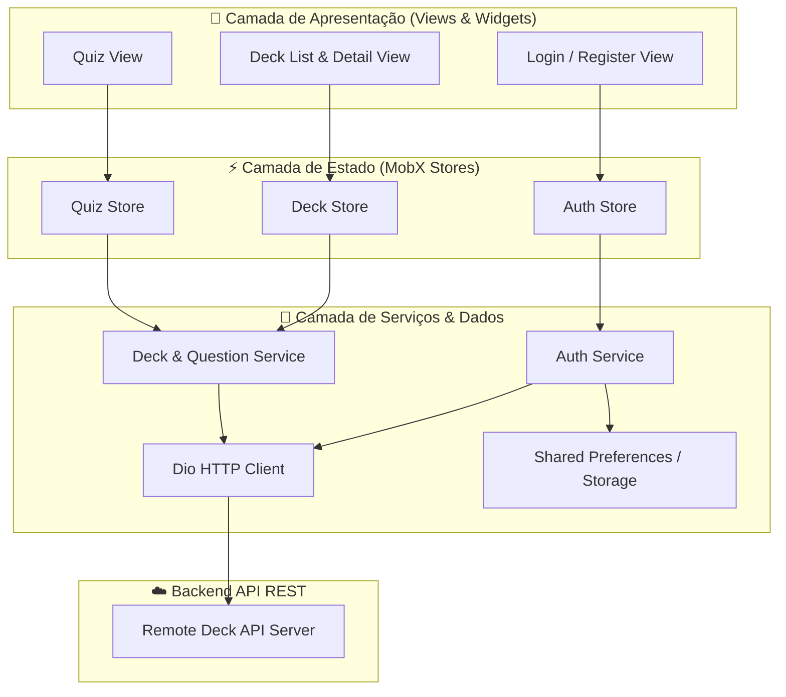

# My Deck App

[](https://flutter.dev/)
[](https://dart.dev/)
[](https://mobx.pub/)
[](https://pub.dev/packages/dio)
[](https://pub.dev/packages/get_it)

> 🇧🇷 **Português** | 🇺🇸 [**English Version**](README.en.md)

Aplicativo mobile prático e intuitivo para criação, gerenciamento e estudo inteligente utilizando flashcards e quizzes interativos.

## 📌 Navegação Rápida

- [📝 Sobre o Projeto](#-sobre-o-projeto)
- [🖼️ Preview](#️-preview)
- [⚡ API Endpoints](#-api-endpoints)
- [✨ Funcionalidades](#-funcionalidades)
- [🛠️ Tecnologias e Ferramentas Utilizadas](#️-tecnologias-e-ferramentas-utilizadas)
- [🏛️ Arquitetura da Solução](#️-arquitetura-da-solução)
- [📁 Estrutura do Repositório](#-estrutura-do-repositório)
- [💡 Decisões Técnicas](#-decisões-técnicas)
- [🚀 Como Executar o Projeto](#-como-executar-o-projeto)

## 📝 Sobre o Projeto

O **My Deck** é uma aplicação mobile desenvolvida em Flutter com o objetivo de potencializar a retenção e o aprendizado ativo por meio do método de repetição com flashcards. 

Com foco em experiência do usuário ágil e fluida, a solução permite que estudantes e profissionais organizem seus estudos em baralhos categorizados (decks), cadastrem perguntas e respostas e testem seus conhecimentos em um módulo de quiz dedicado com pontuação e feedback em tempo real.

## 🖼️ Preview

  

## ⚡ API Endpoints

A aplicação consome uma API RESTful para autenticação, sincronização de decks e gerenciamento de flashcards:

| Método | Endpoint | Descrição | Autenticação |
| :--- | :--- | :--- | :--- |
| `POST` | `/register` | Cadastro de novo usuário | Não |
| `POST` | `/login` | Autenticação de usuário e retorno do token JWT | Não |
| `GET` | `/decks` | Listagem de todos os decks do usuário autenticado | Bearer Token |
| `POST` | `/decks` | Criação de um novo deck de estudos | Bearer Token |
| `DELETE` | `/decks/{id}` | Remoção de um deck específico | Bearer Token |
| `POST` | `/decks/{id}/questions` | Adição de nova pergunta/flashcard a um deck | Bearer Token |

## ✨ Funcionalidades

- 🔐 **Autenticação & Sessão**: Registro e login de usuários com persistência segura do token de autorização.
- 🗂️ **Gerenciamento de Decks**: Criação, listagem e exclusão de baralhos de estudo categorizados.
- 🃏 **Gestão de Flashcards**: Cadastro dinâmico de perguntas e respostas vinculadas a cada deck.
- 🧠 **Modo Quiz Interativo**: Execução de rodadas de estudo com alternância de cartas, validação de respostas e cálculo de taxa de acerto.
- ⚡ **Atualização Reativa de Interface**: UI síncrona aos estados da aplicação via MobX Stores e Observables.

## 🛠️ Tecnologias e Ferramentas Utilizadas

| Camada / Finalidade | Tecnologia | Descrição |
| :--- | :--- | :--- |
| **Linguagem Principal** | **Dart 3.x** | Tipagem estática robusta, sound null safety e alta performance |
| **Framework Mobile** | **Flutter 3.x** | Framework multiplataforma nativo com renderização declarativa |
| **Gerenciamento de Estado** | **MobX & flutter_mobx** | Gerenciamento de estado reativo e transparente baseado em Observables e Actions |
| **Injeção de Dependências** | **GetIt** | Service Locator desacoplado para injeção de clientes HTTP e serviços |
| **Cliente HTTP & Rede** | **Dio** | Requisições REST, interceptors de cabeçalhos e tratamento de exceções |
| **Persistência Local** | **Shared Preferences** | Armazenamento seguro chave-valor para tokens de sessão |
| **Geração de Código** | **build_runner & mobx_codegen** | Automação de boilerplate reativo durante compilação |
| **Testes Automatizados** | **flutter_test & Mocktail** | Testes de unidade e mocks para validação de fluxos de negócio e stores |

## 🏛️ Arquitetura da Solução

O projeto segue o padrão **Feature-Based Architecture**, garantindo modularidade, baixo acoplamento e separação clara entre camadas de apresentação, controle de estado e comunicação de rede:



## 📁 Estrutura do Repositório

```text
9-app-my-deck/
├── assets/                       # Imagens, animações e recursos estáticos
├── lib/
│   ├── features/                 # Módulos organizados por funcionalidade
│   │   ├── authentication/       # Fluxo de login, registro, stores e serviços
│   │   │   ├── dtos/             # Data Transfer Objects de autenticação
│   │   │   ├── services/         # Chamadas de rede de auth
│   │   │   └── views/            # Telas de login e cadastro
│   │   ├── decks/                # Gerenciamento de decks e flashcards
│   │   │   ├── dtos/             # DTOs para criação de perguntas
│   │   │   ├── services/         # Serviços de decks e questões
│   │   │   └── views/            # Telas de listagem, criação e detalhes
│   │   ├── quiz/                 # Módulo de execução de quiz
│   │   │   └── views/            # Interface de teste e estudo
│   │   └── splash_screen/        # Tela inicial de validação de sessão
│   ├── shared/                   # Componentes e utilitários globais
│   │   ├── errors/               # Modelos de tratamento de erro padronizados
│   │   ├── models/               # Entidades de domínio (Deck, Question, etc.)
│   │   ├── utils/                # Constantes, rotas e configurações de rede
│   │   └── views/                # Widgets reutilizáveis compartilhados
│   ├── colors.dart               # Paleta de cores do Design System
│   └── main.dart                 # Ponto de entrada e inicialização do Service Locator
├── test/                         # Suítes de testes unitários organizadas por feature
├── pubspec.yaml                  # Metadados do projeto e dependências
└── analysis_options.yaml         # Regras de linting e análise estática
```

## 💡 Decisões Técnicas

- **Feature-First Architecture**: Estrutura modular em que cada funcionalidade contém suas próprias regras, interfaces e fontes de dados, facilitando a escalabilidade do código.
- **Gerenciamento de Estado com MobX**: Adoção de arquitetura reativa transparente através de Observables, Computeds e Actions, reduzindo re-renderizações desnecessárias e boilerplate complexo.
- **Service Locator com GetIt**: Desacoplamento da criação de instâncias de infraestrutura (como o cliente HTTP `Dio`), tornando a arquitetura flexível e altamente testável.
- **Tratamento Centralizado de Erros**: Encapsulamento de respostas com falha da API em classes de erro customizadas (`CustomError`), garantindo feedback amigável para o usuário na interface.
- **Camada de Testes com Mocktail**: Utilização de mocks e stubs sem necessidade de geração de código adicional para testes unitários rápidos e determinísticos.

## 🚀 Como Executar o Projeto

### Pré-requisitos

- [Flutter SDK](https://docs.flutter.dev/get-started/install) (versão ^3.10.7 recomendada)
- [Dart SDK](https://dart.dev/get-dart)
- Emulador Android / iOS configurado ou dispositivo físico conectado

### Passo a Passo

1. **Clone o repositório:**
   ```bash
   git clone https://github.com/ludson96/9-app-my-deck.git
   cd 9-app-my-deck
   ```

2. **Instale as dependências:**
   ```bash
   flutter pub get
   ```

3. **Gere os arquivos MobX (caso necessário):**
   ```bash
   flutter pub run build_runner build --delete-conflicting-outputs
   ```

4. **Execute o aplicativo:**
   ```bash
   flutter run
   ```

5. **Execute os testes automatizados:**
   ```bash
   flutter test
   ```

<div align="center">
  Desenvolvido por <strong>Ludson Pereira dos Santos</strong> 🚀<br />
  <a href="https://www.linkedin.com/in/ludson96/">LinkedIn</a> • <a href="https://github.com/ludson96">GitHub</a> • <a href="mailto:ludson_ps27@hotmail.com">E-mail</a>
</div>
